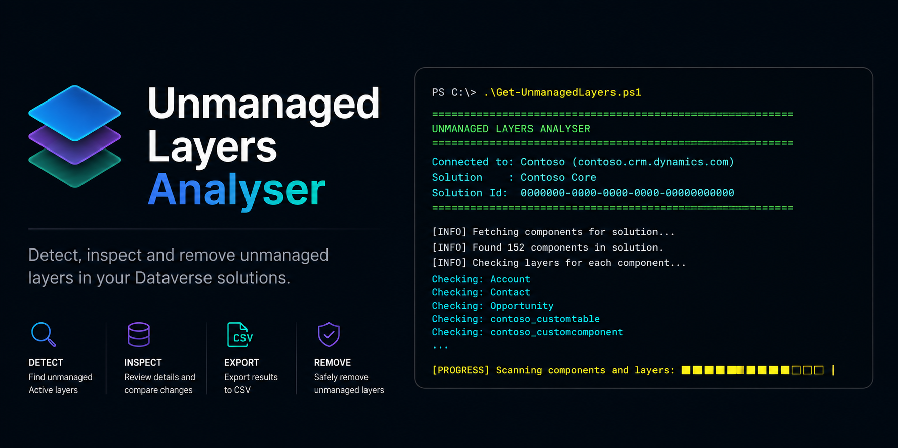

# Unmanaged Layers Analyser



[](https://docs.microsoft.com/powershell/)
[](https://www.powershellgallery.com/packages/Get-UnmanagedLayers)
[](LICENSE)
[]()
[](https://github.com/PowerThomas/unmanaged-layers-analyser/stargazers)
[](https://github.com/PowerThomas/unmanaged-layers-analyser/issues)
[](https://github.com/PowerThomas/unmanaged-layers-analyser/commits/master)

A standalone, interactive PowerShell tool for detecting — and optionally removing — **unmanaged layers** in Power Platform / Dataverse managed solutions.

> Built as a lightweight CLI alternative for environments where XrmToolBox or MSAL-based tools are blocked by Conditional Access policies. Authentication is handled entirely via **Azure CLI**.

---

## Table of Contents

- [Features](#features)
- [Prerequisites](#prerequisites)
- [Installation](#installation)
- [Before You Remove Unmanaged Layers](#before-you-remove-unmanaged-layers)
- [Usage](#usage)
- [How it works](#how-it-works)
- [Contributing](#contributing)
- [License](#license)

---

## Features

- 🔍 **Detect** all unmanaged (`Active`) layers across every component of a managed solution
- 🌈 **Git-style diff** — red `-` lines show the managed baseline value, green `+` lines show the unmanaged override
- 🗑️ **Remove** unmanaged layers with a two-step confirmation (warning + solution name re-entry)
- 📋 **Export** results to CSV including all changed attributes per layer
- 🔐 **Azure CLI authentication** — no MSAL, no app registration, Conditional Access compatible
- 📊 **Summary** per component type with layer counts
- 🔄 **Auto-publish** option after removal

---

## Prerequisites

| Requirement | Notes |
|---|---|
| PowerShell 7+ | Required. Windows PowerShell 5.1 is not supported. |
| [Azure CLI](https://aka.ms/installazurecliwindows) | Must be installed and logged in via `az login`. |
| Power Platform access | At least **Environment Maker** or **System Administrator** role. |

---

## Installation

### Recommended: PowerShell Gallery

```powershell
Install-Script -Name Get-UnmanagedLayers -Scope CurrentUser
```

After installation, run:

```powershell
Get-UnmanagedLayers.ps1
```

Depending on your execution policy, you may need to run:

```powershell
Set-ExecutionPolicy -Scope CurrentUser RemoteSigned
```

### Development install

Use this when contributing or testing unreleased changes:

```powershell
git clone https://github.com/PowerThomas/unmanaged-layers-analyser.git
cd unmanaged-layers-analyser
.\Get-UnmanagedLayers.ps1
```

The script is fully self-contained. No extra PowerShell modules are required.

---

## Before You Remove Unmanaged Layers

This tool can permanently remove unmanaged active layers from Dataverse components.

Recommended workflow:

1. Run the tool in a development or sandbox environment first.
2. Export the result to CSV.
3. Review affected components and changed attributes.
4. Confirm with the solution or application owner.
5. Remove unmanaged layers only after approval.
6. Publish customizations after successful removal.
7. Re-test the impacted app, flow, table, form, or component.

Do not run destructive cleanup in production without approval and a rollback plan.

PowerShell's standard `-WhatIf` support is available for removal operations:

```powershell
Get-UnmanagedLayers.ps1 -WhatIf
```

The tool still requires the interactive removal confirmations before any unmanaged layer is removed.

---

## Usage

```powershell
.\Get-UnmanagedLayers.ps1
```

The script guides you through the following steps interactively:

1. Verifies Azure CLI is installed and that you are logged in
2. Retrieves all Power Platform environments you have access to
3. Lets you select an environment
4. Retrieves all managed solutions in that environment
5. Lets you select a solution
6. Detects unmanaged layers for every component in the solution
7. Displays a results table and a summary by component type
8. Optionally shows a **git-style diff** per component
9. Optionally exports results to **CSV**
10. Optionally **removes** all unmanaged layers (with double confirmation)
11. Optionally **publishes** the environment after removal

### Example — results table

```
  Type                        Name                   Publisher    LayerOrder  Changes
  ----                        ----                   ---------    ----------  -------
  Entity                      appointment            Contoso              1        3
  EnvironmentVariableDefinition MyVariable           Contoso              1        1
```

### Example — git-style diff

```
  diff  [Entity]  appointment
  ============================================================
  --- ContosoCore
  +++ Unmanaged (Active)  publisher: Default Publisher for contoso
  ------------------------------------------------------------
  - synctoexternalsearchindex              True

  + synctoexternalsearchindex              False
```

---

## How it works

The script uses the **Dataverse Web API v9.2** to query the `msdyn_componentlayers` virtual entity.

### Layer detection

The `msdyn_componentlayers` entity requires at least two filter conditions: `msdyn_solutioncomponentname` (the component type string) and `msdyn_componentid`. By omitting the `msdyn_solutionname` filter, the query returns **all layers** for a component — both managed and unmanaged. The script then splits these client-side:

- `msdyn_solutionname eq 'Active'` → unmanaged layer
- Everything else → managed base layers (highest `msdyn_order` = direct baseline)

The `msdyn_changes` field on the unmanaged layer contains a JSON diff of only the changed attributes. The `msdyn_componentjson` field on the managed base layer contains the full component state, used to look up the old values for the diff view.

### Layer removal

Removal is performed via the `RemoveActiveCustomization` Dataverse action:

```http
POST /api/data/v9.2/RemoveActiveCustomization
Content-Type: application/json

{
  "LogicalName": "appointment",
  "Id": "xxxxxxxx-xxxx-xxxx-xxxx-xxxxxxxxxxxx"
}
```

### Authentication

The script uses `az account get-access-token` to obtain Bearer tokens for both the **Power Platform Admin API** (`https://service.powerapps.com/`) and the **Dataverse Web API** (`{orgUrl}`). This approach works with Conditional Access policies and device-based restrictions where MSAL interactive flows are blocked.

---

## Contributing

Contributions are welcome. See [CONTRIBUTING.md](CONTRIBUTING.md) for development principles, local validation steps, and the pull request checklist.

Please use the GitHub issue templates for bug reports and feature requests. Do not include secrets, access tokens, tenant IDs, or production data in public issues.

---

## License

This project is licensed under the **MIT License** — see [LICENSE](LICENSE) for details.
